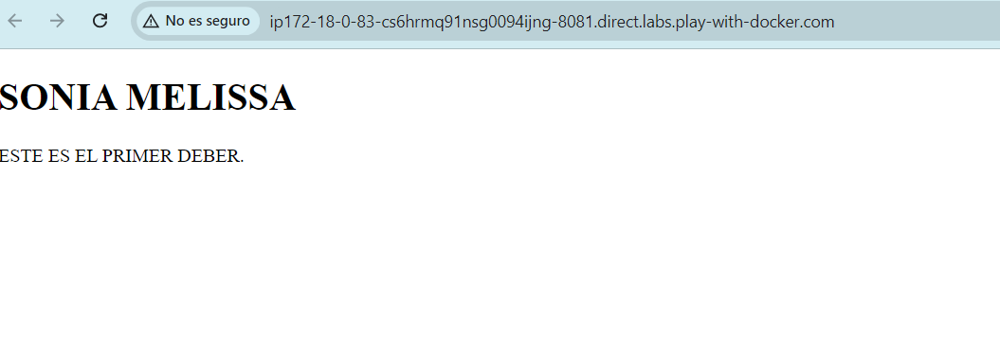

# PRACTICA DE CONTENEDORES WEB 
## 1. Titulo
Elaboracion de dos contenedores diferentes de Nginx
## 2. Tiempo de duración
Para esta practica tarde 27 minutos
## 3. Fundamentos:

Nginx: es un servidor web de código abierto que también funciona como proxy inverso y equilibrador de carga.

Figura 1: Nginx Servidor Web

Docker: es una plataforma que permite la creación y ejecución de aplicaciones en contenedores,Un contenedor es una instancia ligera y portátil que incluye todo lo necesario para que una aplicación funcione, como el código, las librerías y las configuraciones

Figura 2: Desarrollo con Docker

## 4. Conocimientos previos.
Para esta practica es importantes el conocimeinto de los siguientes temas:
   
- Comandos lux: Interaccion con la terminal, comando de navegacion y usos de permisos 
- Manejo de navegador: Conceptos con imagenes,contenedores y redes
- Manejo de navegador web: Para verificar su funcionamiento.

## 5. Objetivos a alcanzar
   
- Implementar contenedores con nginx para servir sitios web.
- Manipular archivos de configuración en nginx
- Verificar el funcionamiento de los contenedores con nginx
  
## 6. Equipo necesario:
  
- Computador con sistema operativo Windows/Linux/Mac.
- Cuenta en docker play.(correo intitucional)
- Visual Studio Code 

## 7. Material de apoyo.
   
- Documentacion de docker.
- Guia de asignatura.
- Cheat sheet sobre los comandos de linux

  
## 8. Procedimiento

Paso 1: En este paso primero abriremos la pagina en nuestro computador la cual seria play with docker y daremos en "add new intance" para poder dar comienzo a la practica.

Figura 3: Comienzo en la pagina.

Paso 2: Para poder hacer que la pagina sea a como nosotros la podamos editar tenemos que hacer con codigo html asi le podremos dar diferentes estilos en cuanto a titulos y subtitulos, este es el primer contenedor que se crea con un nombre y un puerto.

Figura 4: Primer contenedor.

Paso 3: Asi mismo podemos hacer nuestro segundo contenedor donde podemos cambiar el nombre o dejarlo asi mismo, pero el puerto siempre sera diferente.

Figura 5: Segundo Contenedor.

## 9. Resultados esperados:
    
Al finalizar la practica podemos observar los dos contenedores, cada uno con su puerto diferentes en su propio sitio web.

Figura 6: Primer puerto

Figura 7: Segundo puerto

## 10. Bibliografía
    
- Docker: Accelerated Container Application Development. (2024, 8 julio). Docker. https://www.docker.com/
- nginx. (s. f.). https://nginx.org/en/